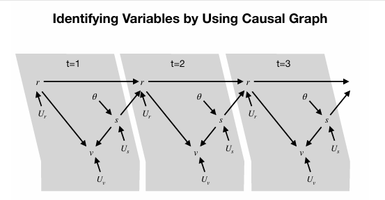

# Statistical Analysis and Causal Inference

This repository documents my implementation and interpretation of statistical models using MATLAB.
The focus is on understanding how statistical structure and assumptions influence interpretation, rather than prediction.

---

## 📊 Regression Analysis

### Multiple Linear Regression

I constructed a multiple linear regression model to explain jump height (y) using:

* x1: height
* x2: weight
* x3: language score

#### Results

* Height (x1): significant positive effect (p < 0.001)
* Weight (x2): significant negative effect (p < 0.001)
* Language score (x3): not significant (p = 0.902)

#### Interpretation

Jump height is primarily explained by physical variables (height and weight), while language score does not show a statistically meaningful relationship.

---

### Multicollinearity Diagnostics

To evaluate whether predictors independently contribute to the model, I examined:

* Correlation matrix: all |r| < 0.1
* Variance Inflation Factor (VIF): all < 5
* Condition index: between 1.00 and 1.09

#### Interpretation

There is no evidence of multicollinearity.
Therefore, coefficient estimates are stable and can be interpreted independently.

---

## 📈 Logistic Regression

I applied logistic regression to model infection status (binary outcome):

* x1: body temperature
* x2: cough frequency
* x3: public exposure

#### Results

* Temperature (x1): significant (p < 0.001)
* Cough frequency (x2): significant (p < 0.001)
* Public exposure (x3): not significant (p = 0.3425)

#### Interpretation

Physiological variables (temperature and cough frequency) are strong predictors, while behavioral exposure is not statistically significant in this dataset.

---

## ⚠️ Multiple Comparison

When testing multiple hypotheses, the probability of Type I error increases.

To address this, I examined:

* Familywise Error Rate (FWER)
* False Discovery Rate (FDR)

#### Interpretation

FWER strictly controls false positives but reduces statistical power, while FDR allows more discoveries at the cost of tolerating some false positives.

---

## 🔗 Identifying Variables Using a Causal Graph

  

The causal graph provides the structural assumptions used to identify variables and test conditional independence in this analysis.

---

### Variable Identification

I inferred the identity of observed variables (x1–x6) by analyzing correlation structure:

* Variable most strongly correlated with θ → identified as **s**
* Indirect correlations → used to infer **v**
* Remaining variables assigned based on dependency structure

Final mapping:

* x6 = s
* x1 = Us
* x3 = v
* x5 = Uv
* x2 = r
* x4 = Ur

---

### Validation via Conditional Independence

To verify the inferred structure, I tested causal graph properties using partial correlation:

* Chain (θ → s → v):
  partialcorr(θ, v | s) ≈ 0 → conditional independence

* Collider (r → v ← s):
  partialcorr(r, s | v) > 0 → dependence induced

#### Interpretation

The results are consistent with causal graph theory, supporting the validity of the inferred variable mapping.

---

## 🛠 Implementation

* Environment: MATLAB
* Methods:

  * Ordinary Least Squares (OLS)
  * Logistic regression
  * Correlation analysis
  * Variance Inflation Factor (VIF)
  * Condition index
  * Partial correlation

---

## 📝 Notes

* The dataset is simulated
* The focus is on interpretation and reasoning, not prediction
* Results are specific to the given data structure

---

## 📚 References

* Montgomery, D. C., et al. (2021). *Introduction to Linear Regression Analysis*
* Pearl, J., et al. (2016). *Causal Inference in Statistics: A Primer*
* Ai, C., & Norton, E. C. (2003). *Interaction terms in logit and probit models*

---
